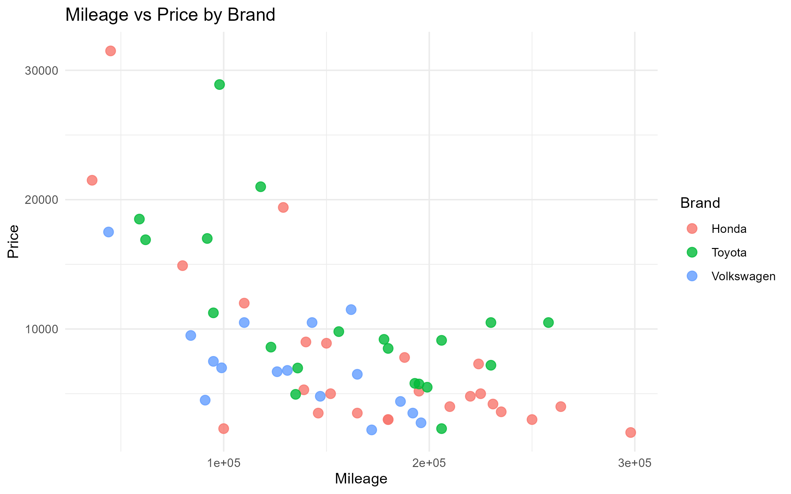
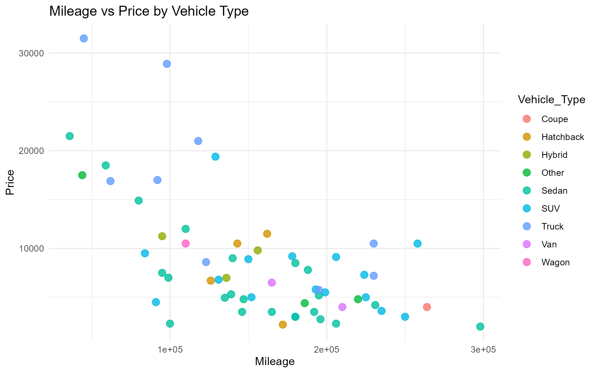

# Northern California Used Car Price Analysis

**Author:** Alejandro Alvarez

## Project Overview

This project analyzes used vehicle pricing trends across Honda, Toyota, and Volkswagen vehicles in Northern California using R. The analysis includes data visualization, exploratory data analysis, and regression modeling to understand how mileage, vehicle age, and vehicle type influence resale value.

The goal of this project is to determine which factors influence used vehicle prices and to build a foundation for future predictive modeling and machine learning applications.

## Dataset

The dataset was manually collected from Craigslist vehicle listings and includes:

* 61 used vehicle listings
* Honda, Toyota, and Volkswagen vehicles
* Northern California market data

### Variables

* Price
* Mileage
* Year
* Brand
* Vehicle Type
* Fuel Type
* Condition

## Visualization 1: Mileage vs Price by Brand

### Summary

The graph shows a negative relationship between mileage and vehicle price. As mileage increases, vehicle prices generally decline. Toyota vehicles appear to retain value better than some competing brands, particularly at higher mileage levels.

## Visualization 2: Mileage vs Price by Vehicle Type

### Summary

Vehicle type appears to influence resale value. Trucks and SUVs tend to maintain higher prices even at elevated mileage levels, while sedans display wider depreciation patterns. Hybrid vehicles cluster within moderate mileage and price ranges.

## Regression Analysis

### Model

Price = f(Mileage, Year)

### Results

The regression analysis indicates:

* Mileage has a negative effect on vehicle price.
* Vehicle year has a positive effect on vehicle price.
* Newer vehicles generally command higher resale values.
* The model explains approximately 46% of the variation in vehicle prices.

### Interpretation

The results suggest that vehicle depreciation is strongly related to mileage while vehicle age remains an important predictor of market value. These findings are consistent with expected economic behavior in the used vehicle market.

## Prediction Example

Using the regression model, a vehicle's expected market value can be estimated based on mileage and year.

Example:

* Vehicle: Toyota Sedan
* Year: 2016
* Mileage: 120,000

Predicted Value:

* Approximately $13,173

This demonstrates how predictive analytics can be used to estimate fair market value and identify potentially underpriced or overpriced listings.

## Tools Used

* R
* RStudio
* ggplot2
* tidyverse
* readxl
* Git
* GitHub
* R Markdown

## Future Improvements

Future versions of this project may include:

* Larger datasets (200+ vehicles)
* Additional vehicle brands
* Vehicle condition scoring
* Title status variables
* Geographic location effects
* Machine learning models
* Interactive dashboards
* AI-powered vehicle valuation tools

## Project Status

Version 1.0 Complete

Current Features:

* Data Collection
* Data Cleaning
* Exploratory Data Analysis
* Data Visualization
* Regression Modeling
* Vehicle Price Prediction

Planned Features:

* Advanced Regression Models
* Machine Learning Models
* Streamlit Web Application
* AI Vehicle Pricing Assistant
